# Kotlin JIB Example
This sample project demonstrates capabilities of JIB - a new tool by Google targeted to simplify containerising your JVM apps (you can read more about it in [Introducing Jib — build Java Docker images better](https://cloud.google.com/blog/products/gcp/introducing-jib-build-java-docker-images-better)). There are also other options to do the same thing - e.g. writing your own Dockerfile, using [docker-maven-plugin](https://github.com/fabric8io/docker-maven-plugin) or [docker-maven-plugin](https://github.com/spotify/docker-maven-plugin).

JIB is advertised to have 2 main advantages:

* demonless
    * you can push your images directly to external container repository (DockerHub, Google Container Registry, Amazon Elastic Container Registry, etc.)
* optimal use of layers
    * the tool separates different layers (base image, dependencies, resources, classes) so in case you change just your classes only the tiny top layer (well, depends on the size of your codebase :) ) is changed
    
This projects focuses to demonstrate the second feature.

# Requirements
In order to complete the steps below you will need:
* Java 8 or higher
* Docker installed locally (Linux, Docker for Mac or Docker for Windows)
    * _I have used Docker version 18.06 - the commands inspecting the docker layers might not work in other major versions of Docker_

# Project setup
This sample project has been created using [start.spring.io](http://start.spring.io/) so it is based on spring-boot. To make things a bit more fancy I have created it using Gradle as the build tool and Kotlin as the language, but the principles will stay the same for other build tools (Maven) or JVM languages (Java, Groovy, Scala, etc.).

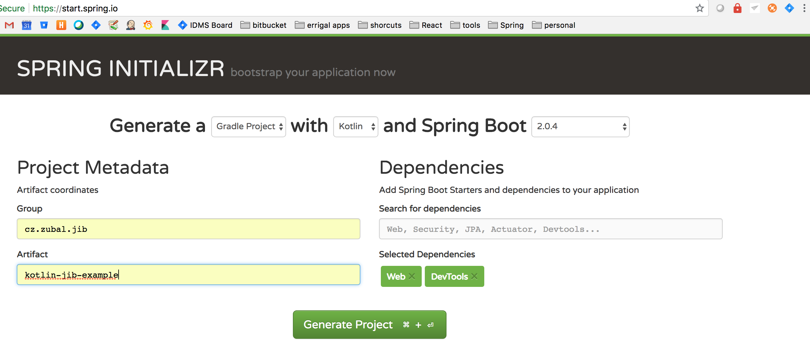

After generating the basic application skeleton I have created a very simple REST Controller, which exposes hello-world-style API - this can be checked in the main class: [KotlinJibExampleApplication.kt](./src/main/kotlin/cz/zubal/jib/kotlinjibexample/KotlinJibExampleApplication.kt).

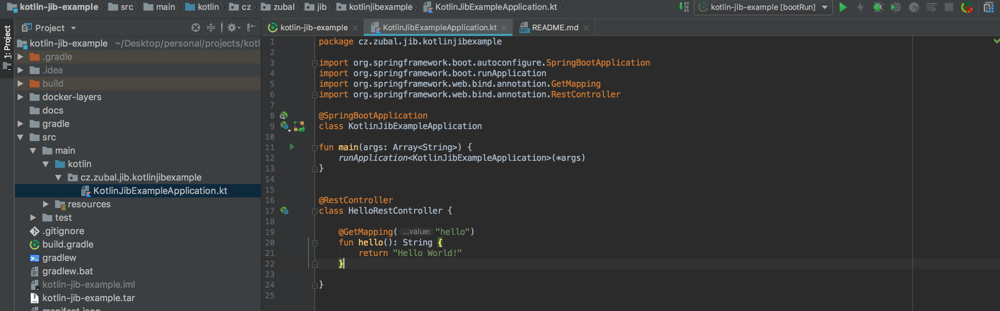

Then I have added the JIB Gradle plugin to _build.gradle_ in order to build/push the image of my app (there is also similar Maven plugin).

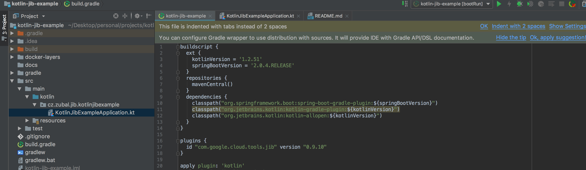

# Running and verifying the project locally
To verify the project works we can build and run it using gradle:
```sh 
./gradlew bootRun
```
Which should print someting like this:
```
2018-09-02 19:41:35.375  INFO 31632 --- [  restartedMain] o.s.b.d.a.OptionalLiveReloadServer       : LiveReload server is running on port 35729
2018-09-02 19:41:35.416  INFO 31632 --- [  restartedMain] o.s.j.e.a.AnnotationMBeanExporter        : Registering beans for JMX exposure on startup
2018-09-02 19:41:35.466  INFO 31632 --- [  restartedMain] o.s.b.w.embedded.tomcat.TomcatWebServer  : Tomcat started on port(s): 8080 (http) with context path ''
2018-09-02 19:41:35.471  INFO 31632 --- [  restartedMain] c.z.j.k.KotlinJibExampleApplicationKt    : Started KotlinJibExampleApplicationKt in 2.711 seconds (JVM running for 3.143)
<==========---> 80% EXECUTING [3m 47s]
> :bootRun
```
Then you can verify the REST API (in a different terminal):
```sh
http localhost:8080/hello
```
(this command uses the excellent [httpie](https://httpie.org/) CLI tool , but feel free to use wget/curl or browser)

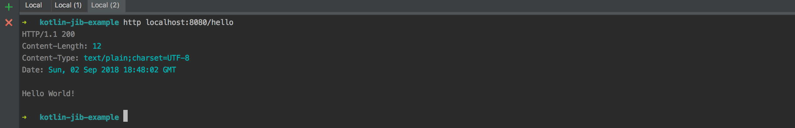

# Pushing image to local docker
This step will push the image to local docker (so we will not benefit from the first advantage listed above), but things should work generally in the same way with external repos (you might need to configure authentication).

First, we will check the current list of our docker images:
```sh
docker images
```

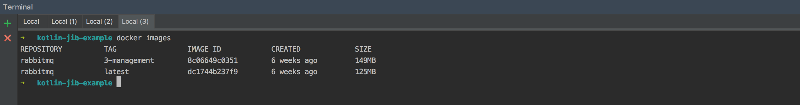

(we can see I have just some RabbitMQ images)

Then we will publish our image to docker using JIB Gradle plugin:
```sh
./gradlew jibDockerBuild
```

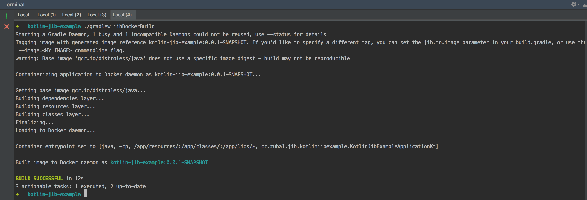

We can verify we have the image in Docker:
```sh
docker images
```

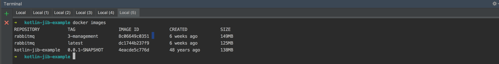

(Our kotlin-jib-example is there, woohoo!)

Let's now run our image:
```sh
docker run -d -p 8090:8080 kotlin-jib-example:0.0.1-SNAPSHOT
```

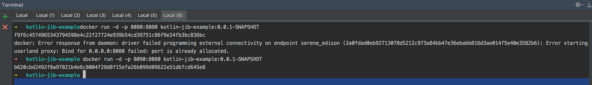

(you can see the first of my attempts failed as the port clashed with the already running app, I have solved that by mapping the container port to host port 8090)

Verify the app running in docker (port 8090 instead of 8080):
```sh
http localhost:8090/hello
```

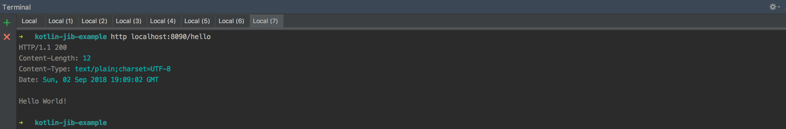

So that's it - we don't have to write our Dockerfile and we have the potential to push this image straight to external docker repos (even without having the right version of Docker installed locally).

# Inspecting the image layers to verify JIB layering
We have already verified that the app image is in docker and it's size is 138MB, but let's now verify the layers of the image.

We can first run docker history:
```sh
docker history kotlin-jib-example:0.0.1-SNAPSHOT
```

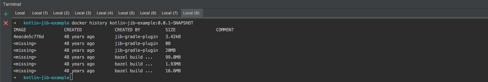

From that we can very roughly guess that the bottom 3 layer are the base image (said to be distroless by JIB docs). The 3rd from the top are likely our spring-boot dependencies (jars), 2nd are resources (we don't have any) and 1st are the actual code.

If you are not satisfied by this rough guess (just like me), you can further inspect the image by following commands.

Saving the docker image and extracting it to _docker-layers_ folder:
```sh
docker save kotlin-jib-example:0.0.1-SNAPSHOT -o kotlin-jib-example-layers.tar
mkdir docker-layers
tar xf kotlin-jib-example-layers.tar -C docker-layers
```

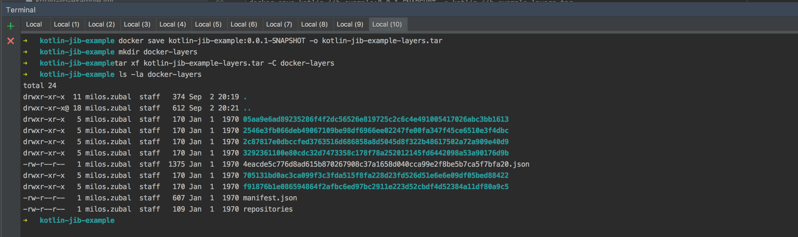

No we can run a script which will show us the contents of the layers (this basically iterates the _tar_ files, which contain the layer filesystems of each layer and prints them, the _awk_ section is used to limit the depth of the printing to 3 levels):
```sh
for layer in docker-layers/*/*.tar; do printf '%20s\n' | tr ' ' -; echo $layer; tar tvf $layer | awk -F/ '{if (NF<5) print }'; done;
```
The output of the command is quite long, but have mainly the following sections

Java 8 (OpenJDK):

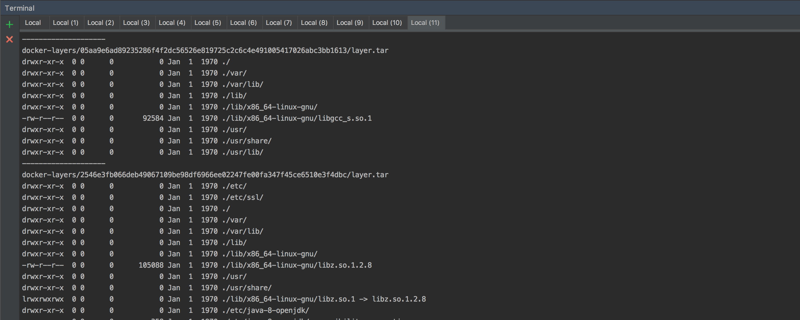

Linux, resources and spring-boot dependencies (each in separate layer):

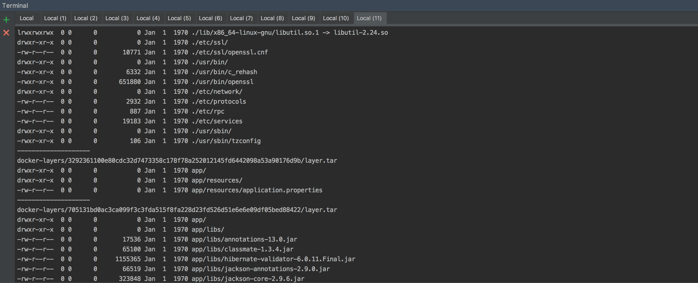

Application clasess:

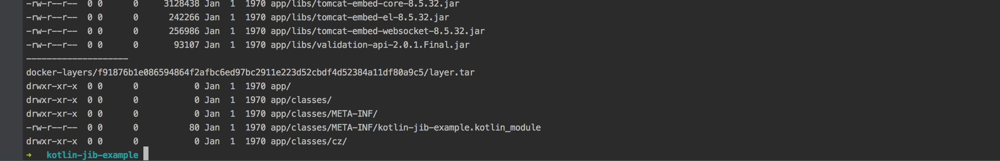

So now we have verified the layering of the image is according to what JIB says. Which is really great as if you change your code now and push the image again, only the tiny top layer will be actually transferred (all the other layers will be the same), which will optimise your bandwidth, space in your image repo as well as the speed of the build.
